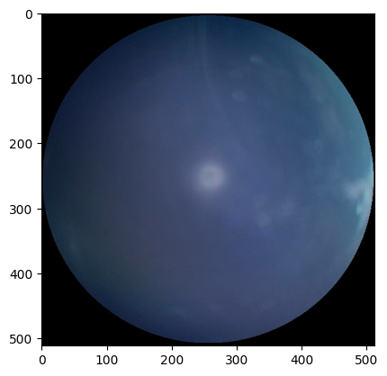
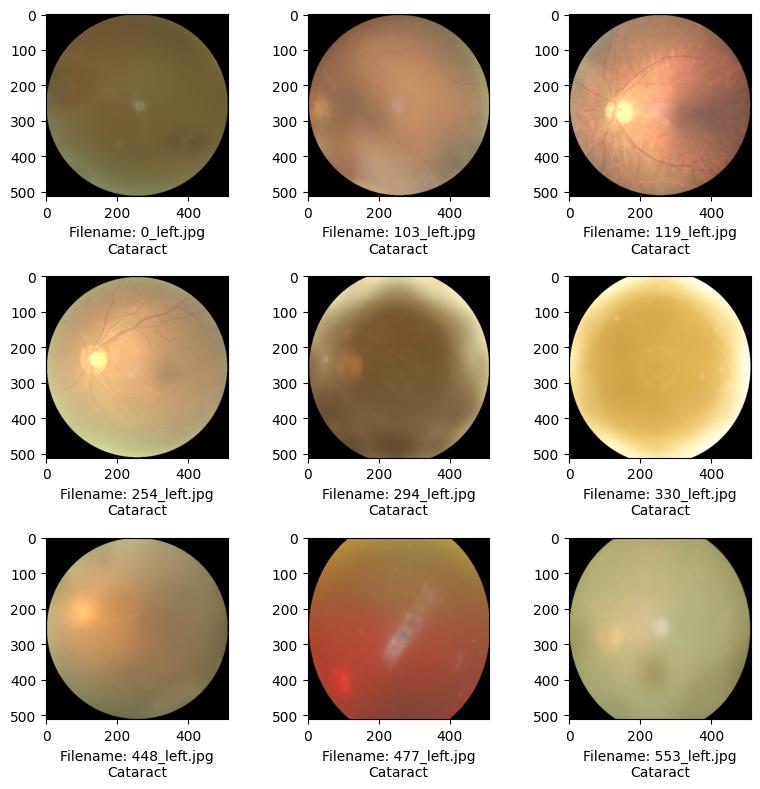
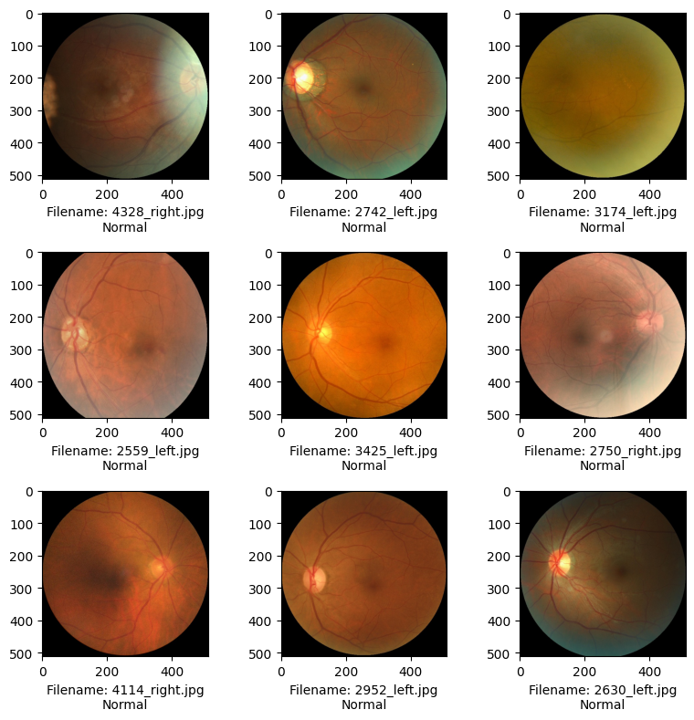
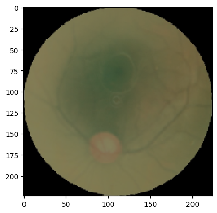
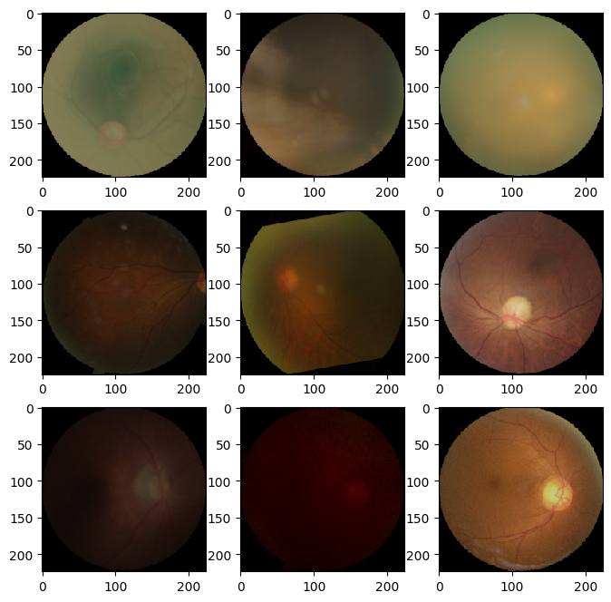
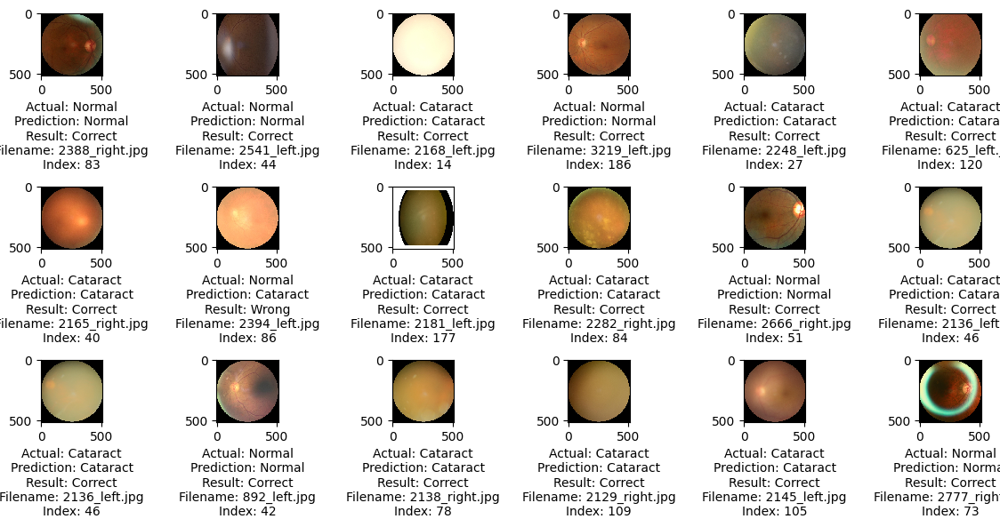
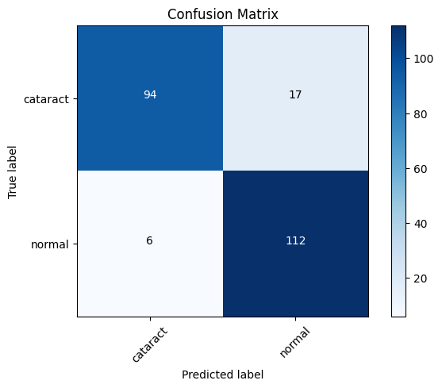

```python
import pandas as pd # data processing, CSV file I/O (e.g. pd.read_csv)
import os
import random
import itertools
import cv2
import matplotlib.pyplot as plt
from tqdm import tqdm
import math

import tensorflow as tf
from tensorflow import keras
from tensorflow.keras import layers
from tensorflow.keras.preprocessing.image import load_img,img_to_array

from tensorflow.keras.utils import to_categorical

```


```python
from keras.models import Model, Sequential, load_model
from keras.layers import Dense, Conv2D, MaxPool2D, Flatten, Reshape, Dropout
from keras.preprocessing import image
from tensorflow.keras.preprocessing.image import ImageDataGenerator

from keras.optimizers import Adam
from keras.callbacks import ModelCheckpoint, EarlyStopping


```


```python
## models to import
from keras.applications.vgg16 import VGG16
from keras.applications.vgg16 import preprocess_input

from sklearn.metrics import confusion_matrix,classification_report,accuracy_score
from sklearn.model_selection import train_test_split
from sklearn.utils import shuffle
```


```python
img_size = 224
```


```python
df_data = pd.read_csv(r"C:\Users\adars\OneDrive\Desktop\jupyter projects\data set\full_df.csv")
df_data.head()
```


<div>
<style scoped>
    .dataframe tbody tr th:only-of-type {
        vertical-align: middle;
    }

    .dataframe tbody tr th {
        vertical-align: top;
    }

    .dataframe thead th {
        text-align: right;
    }
</style>
<table border="1" class="dataframe">
  <thead>
    <tr style="text-align: right;">
      <th></th>
      <th>ID</th>
      <th>Patient Age</th>
      <th>Patient Sex</th>
      <th>Left-Fundus</th>
      <th>Right-Fundus</th>
      <th>Left-Diagnostic Keywords</th>
      <th>Right-Diagnostic Keywords</th>
      <th>N</th>
      <th>D</th>
      <th>G</th>
      <th>C</th>
      <th>A</th>
      <th>H</th>
      <th>M</th>
      <th>O</th>
      <th>filepath</th>
      <th>labels</th>
      <th>target</th>
      <th>filename</th>
    </tr>
  </thead>
  <tbody>
    <tr>
      <th>0</th>
      <td>0</td>
      <td>69</td>
      <td>Female</td>
      <td>0_left.jpg</td>
      <td>0_right.jpg</td>
      <td>cataract</td>
      <td>normal fundus</td>
      <td>0</td>
      <td>0</td>
      <td>0</td>
      <td>1</td>
      <td>0</td>
      <td>0</td>
      <td>0</td>
      <td>0</td>
      <td>../input/ocular-disease-recognition-odir5k/ODI...</td>
      <td>['N']</td>
      <td>[1, 0, 0, 0, 0, 0, 0, 0]</td>
      <td>0_right.jpg</td>
    </tr>
    <tr>
      <th>1</th>
      <td>1</td>
      <td>57</td>
      <td>Male</td>
      <td>1_left.jpg</td>
      <td>1_right.jpg</td>
      <td>normal fundus</td>
      <td>normal fundus</td>
      <td>1</td>
      <td>0</td>
      <td>0</td>
      <td>0</td>
      <td>0</td>
      <td>0</td>
      <td>0</td>
      <td>0</td>
      <td>../input/ocular-disease-recognition-odir5k/ODI...</td>
      <td>['N']</td>
      <td>[1, 0, 0, 0, 0, 0, 0, 0]</td>
      <td>1_right.jpg</td>
    </tr>
    <tr>
      <th>2</th>
      <td>2</td>
      <td>42</td>
      <td>Male</td>
      <td>2_left.jpg</td>
      <td>2_right.jpg</td>
      <td>laser spot，moderate non proliferative retinopathy</td>
      <td>moderate non proliferative retinopathy</td>
      <td>0</td>
      <td>1</td>
      <td>0</td>
      <td>0</td>
      <td>0</td>
      <td>0</td>
      <td>0</td>
      <td>1</td>
      <td>../input/ocular-disease-recognition-odir5k/ODI...</td>
      <td>['D']</td>
      <td>[0, 1, 0, 0, 0, 0, 0, 0]</td>
      <td>2_right.jpg</td>
    </tr>
    <tr>
      <th>3</th>
      <td>4</td>
      <td>53</td>
      <td>Male</td>
      <td>4_left.jpg</td>
      <td>4_right.jpg</td>
      <td>macular epiretinal membrane</td>
      <td>mild nonproliferative retinopathy</td>
      <td>0</td>
      <td>1</td>
      <td>0</td>
      <td>0</td>
      <td>0</td>
      <td>0</td>
      <td>0</td>
      <td>1</td>
      <td>../input/ocular-disease-recognition-odir5k/ODI...</td>
      <td>['D']</td>
      <td>[0, 1, 0, 0, 0, 0, 0, 0]</td>
      <td>4_right.jpg</td>
    </tr>
    <tr>
      <th>4</th>
      <td>5</td>
      <td>50</td>
      <td>Female</td>
      <td>5_left.jpg</td>
      <td>5_right.jpg</td>
      <td>moderate non proliferative retinopathy</td>
      <td>moderate non proliferative retinopathy</td>
      <td>0</td>
      <td>1</td>
      <td>0</td>
      <td>0</td>
      <td>0</td>
      <td>0</td>
      <td>0</td>
      <td>0</td>
      <td>../input/ocular-disease-recognition-odir5k/ODI...</td>
      <td>['D']</td>
      <td>[0, 1, 0, 0, 0, 0, 0, 0]</td>
      <td>5_right.jpg</td>
    </tr>
  </tbody>
</table>
</div>


```python
df_data[df_data.C==1].head()

```


<div>
<style scoped>
    .dataframe tbody tr th:only-of-type {
        vertical-align: middle;
    }

    .dataframe tbody tr th {
        vertical-align: top;
    }

    .dataframe thead th {
        text-align: right;
    }
</style>
<table border="1" class="dataframe">
  <thead>
    <tr style="text-align: right;">
      <th></th>
      <th>ID</th>
      <th>Patient Age</th>
      <th>Patient Sex</th>
      <th>Left-Fundus</th>
      <th>Right-Fundus</th>
      <th>Left-Diagnostic Keywords</th>
      <th>Right-Diagnostic Keywords</th>
      <th>N</th>
      <th>D</th>
      <th>G</th>
      <th>C</th>
      <th>A</th>
      <th>H</th>
      <th>M</th>
      <th>O</th>
      <th>filepath</th>
      <th>labels</th>
      <th>target</th>
      <th>filename</th>
    </tr>
  </thead>
  <tbody>
    <tr>
      <th>0</th>
      <td>0</td>
      <td>69</td>
      <td>Female</td>
      <td>0_left.jpg</td>
      <td>0_right.jpg</td>
      <td>cataract</td>
      <td>normal fundus</td>
      <td>0</td>
      <td>0</td>
      <td>0</td>
      <td>1</td>
      <td>0</td>
      <td>0</td>
      <td>0</td>
      <td>0</td>
      <td>../input/ocular-disease-recognition-odir5k/ODI...</td>
      <td>['N']</td>
      <td>[1, 0, 0, 0, 0, 0, 0, 0]</td>
      <td>0_right.jpg</td>
    </tr>
    <tr>
      <th>20</th>
      <td>24</td>
      <td>75</td>
      <td>Female</td>
      <td>24_left.jpg</td>
      <td>24_right.jpg</td>
      <td>normal fundus</td>
      <td>cataract</td>
      <td>0</td>
      <td>0</td>
      <td>0</td>
      <td>1</td>
      <td>0</td>
      <td>0</td>
      <td>0</td>
      <td>0</td>
      <td>../input/ocular-disease-recognition-odir5k/ODI...</td>
      <td>['C']</td>
      <td>[0, 0, 0, 1, 0, 0, 0, 0]</td>
      <td>24_right.jpg</td>
    </tr>
    <tr>
      <th>65</th>
      <td>81</td>
      <td>66</td>
      <td>Male</td>
      <td>81_left.jpg</td>
      <td>81_right.jpg</td>
      <td>moderate non proliferative retinopathy，cataract</td>
      <td>moderate non proliferative retinopathy，cataract</td>
      <td>0</td>
      <td>1</td>
      <td>0</td>
      <td>1</td>
      <td>0</td>
      <td>0</td>
      <td>0</td>
      <td>0</td>
      <td>../input/ocular-disease-recognition-odir5k/ODI...</td>
      <td>['D']</td>
      <td>[0, 1, 0, 0, 0, 0, 0, 0]</td>
      <td>81_right.jpg</td>
    </tr>
    <tr>
      <th>86</th>
      <td>103</td>
      <td>55</td>
      <td>Female</td>
      <td>103_left.jpg</td>
      <td>103_right.jpg</td>
      <td>cataract</td>
      <td>normal fundus</td>
      <td>0</td>
      <td>0</td>
      <td>0</td>
      <td>1</td>
      <td>0</td>
      <td>0</td>
      <td>0</td>
      <td>0</td>
      <td>../input/ocular-disease-recognition-odir5k/ODI...</td>
      <td>['N']</td>
      <td>[1, 0, 0, 0, 0, 0, 0, 0]</td>
      <td>103_right.jpg</td>
    </tr>
    <tr>
      <th>93</th>
      <td>112</td>
      <td>57</td>
      <td>Female</td>
      <td>112_left.jpg</td>
      <td>112_right.jpg</td>
      <td>normal fundus</td>
      <td>cataract</td>
      <td>0</td>
      <td>0</td>
      <td>0</td>
      <td>1</td>
      <td>0</td>
      <td>0</td>
      <td>0</td>
      <td>0</td>
      <td>../input/ocular-disease-recognition-odir5k/ODI...</td>
      <td>['C']</td>
      <td>[0, 0, 0, 1, 0, 0, 0, 0]</td>
      <td>112_right.jpg</td>
    </tr>
  </tbody>
</table>
</div>


```python
df_data.info()

```

    <class 'pandas.core.frame.DataFrame'>
    RangeIndex: 6392 entries, 0 to 6391
    Data columns (total 19 columns):
     #   Column                     Non-Null Count  Dtype 
    ---  ------                     --------------  ----- 
     0   ID                         6392 non-null   int64 
     1   Patient Age                6392 non-null   int64 
     2   Patient Sex                6392 non-null   object
     3   Left-Fundus                6392 non-null   object
     4   Right-Fundus               6392 non-null   object
     5   Left-Diagnostic Keywords   6392 non-null   object
     6   Right-Diagnostic Keywords  6392 non-null   object
     7   N                          6392 non-null   int64 
     8   D                          6392 non-null   int64 
     9   G                          6392 non-null   int64 
     10  C                          6392 non-null   int64 
     11  A                          6392 non-null   int64 
     12  H                          6392 non-null   int64 
     13  M                          6392 non-null   int64 
     14  O                          6392 non-null   int64 
     15  filepath                   6392 non-null   object
     16  labels                     6392 non-null   object
     17  target                     6392 non-null   object
     18  filename                   6392 non-null   object
    dtypes: int64(10), object(9)
    memory usage: 948.9+ KB
    


```python
df_data[df_data == 1].sum(axis=0)

```


    ID                              2.0
    Patient Age                    28.0
    Patient Sex                       0
    Left-Fundus                       0
    Right-Fundus                      0
    Left-Diagnostic Keywords          0
    Right-Diagnostic Keywords         0
    N                            2101.0
    D                            2123.0
    G                             397.0
    C                             402.0
    A                             319.0
    H                             203.0
    M                             306.0
    O                            1588.0
    filepath                          0
    labels                            0
    target                            0
    filename                          0
    dtype: object


```python
df_data2 = df_data.iloc[:, 1:7]
#df_data2['filepath'] = pd.Series(df_data['filepath'])
df_data2.head()
```


<div>
<style scoped>
    .dataframe tbody tr th:only-of-type {
        vertical-align: middle;
    }

    .dataframe tbody tr th {
        vertical-align: top;
    }

    .dataframe thead th {
        text-align: right;
    }
</style>
<table border="1" class="dataframe">
  <thead>
    <tr style="text-align: right;">
      <th></th>
      <th>Patient Age</th>
      <th>Patient Sex</th>
      <th>Left-Fundus</th>
      <th>Right-Fundus</th>
      <th>Left-Diagnostic Keywords</th>
      <th>Right-Diagnostic Keywords</th>
    </tr>
  </thead>
  <tbody>
    <tr>
      <th>0</th>
      <td>69</td>
      <td>Female</td>
      <td>0_left.jpg</td>
      <td>0_right.jpg</td>
      <td>cataract</td>
      <td>normal fundus</td>
    </tr>
    <tr>
      <th>1</th>
      <td>57</td>
      <td>Male</td>
      <td>1_left.jpg</td>
      <td>1_right.jpg</td>
      <td>normal fundus</td>
      <td>normal fundus</td>
    </tr>
    <tr>
      <th>2</th>
      <td>42</td>
      <td>Male</td>
      <td>2_left.jpg</td>
      <td>2_right.jpg</td>
      <td>laser spot，moderate non proliferative retinopathy</td>
      <td>moderate non proliferative retinopathy</td>
    </tr>
    <tr>
      <th>3</th>
      <td>53</td>
      <td>Male</td>
      <td>4_left.jpg</td>
      <td>4_right.jpg</td>
      <td>macular epiretinal membrane</td>
      <td>mild nonproliferative retinopathy</td>
    </tr>
    <tr>
      <th>4</th>
      <td>50</td>
      <td>Female</td>
      <td>5_left.jpg</td>
      <td>5_right.jpg</td>
      <td>moderate non proliferative retinopathy</td>
      <td>moderate non proliferative retinopathy</td>
    </tr>
  </tbody>
</table>
</div>


```python
img_dir =(r"C:\Users\adars\OneDrive\Desktop\jupyter projects\data set\preprocessed_images")
```


```python
df_data2[df_data2['Left-Diagnostic Keywords'].str.match('cataract')].head()

```


<div>
<style scoped>
    .dataframe tbody tr th:only-of-type {
        vertical-align: middle;
    }

    .dataframe tbody tr th {
        vertical-align: top;
    }

    .dataframe thead th {
        text-align: right;
    }
</style>
<table border="1" class="dataframe">
  <thead>
    <tr style="text-align: right;">
      <th></th>
      <th>Patient Age</th>
      <th>Patient Sex</th>
      <th>Left-Fundus</th>
      <th>Right-Fundus</th>
      <th>Left-Diagnostic Keywords</th>
      <th>Right-Diagnostic Keywords</th>
    </tr>
  </thead>
  <tbody>
    <tr>
      <th>0</th>
      <td>69</td>
      <td>Female</td>
      <td>0_left.jpg</td>
      <td>0_right.jpg</td>
      <td>cataract</td>
      <td>normal fundus</td>
    </tr>
    <tr>
      <th>86</th>
      <td>55</td>
      <td>Female</td>
      <td>103_left.jpg</td>
      <td>103_right.jpg</td>
      <td>cataract</td>
      <td>normal fundus</td>
    </tr>
    <tr>
      <th>100</th>
      <td>59</td>
      <td>Male</td>
      <td>119_left.jpg</td>
      <td>119_right.jpg</td>
      <td>cataract</td>
      <td>drusen</td>
    </tr>
    <tr>
      <th>218</th>
      <td>60</td>
      <td>Female</td>
      <td>254_left.jpg</td>
      <td>254_right.jpg</td>
      <td>cataract</td>
      <td>macular epiretinal membrane</td>
    </tr>
    <tr>
      <th>256</th>
      <td>69</td>
      <td>Female</td>
      <td>294_left.jpg</td>
      <td>294_right.jpg</td>
      <td>cataract</td>
      <td>normal fundus</td>
    </tr>
  </tbody>
</table>
</div>


```python
df_left_cat = df_data2[df_data2['Left-Diagnostic Keywords'].str.match('cataract')]
print(len(df_left_cat))
```

    294
    


```python
df_data[df_data['Right-Diagnostic Keywords'].str.match('cataract')].head()

```


<div>
<style scoped>
    .dataframe tbody tr th:only-of-type {
        vertical-align: middle;
    }

    .dataframe tbody tr th {
        vertical-align: top;
    }

    .dataframe thead th {
        text-align: right;
    }
</style>
<table border="1" class="dataframe">
  <thead>
    <tr style="text-align: right;">
      <th></th>
      <th>ID</th>
      <th>Patient Age</th>
      <th>Patient Sex</th>
      <th>Left-Fundus</th>
      <th>Right-Fundus</th>
      <th>Left-Diagnostic Keywords</th>
      <th>Right-Diagnostic Keywords</th>
      <th>N</th>
      <th>D</th>
      <th>G</th>
      <th>C</th>
      <th>A</th>
      <th>H</th>
      <th>M</th>
      <th>O</th>
      <th>filepath</th>
      <th>labels</th>
      <th>target</th>
      <th>filename</th>
    </tr>
  </thead>
  <tbody>
    <tr>
      <th>20</th>
      <td>24</td>
      <td>75</td>
      <td>Female</td>
      <td>24_left.jpg</td>
      <td>24_right.jpg</td>
      <td>normal fundus</td>
      <td>cataract</td>
      <td>0</td>
      <td>0</td>
      <td>0</td>
      <td>1</td>
      <td>0</td>
      <td>0</td>
      <td>0</td>
      <td>0</td>
      <td>../input/ocular-disease-recognition-odir5k/ODI...</td>
      <td>['C']</td>
      <td>[0, 0, 0, 1, 0, 0, 0, 0]</td>
      <td>24_right.jpg</td>
    </tr>
    <tr>
      <th>93</th>
      <td>112</td>
      <td>57</td>
      <td>Female</td>
      <td>112_left.jpg</td>
      <td>112_right.jpg</td>
      <td>normal fundus</td>
      <td>cataract</td>
      <td>0</td>
      <td>0</td>
      <td>0</td>
      <td>1</td>
      <td>0</td>
      <td>0</td>
      <td>0</td>
      <td>0</td>
      <td>../input/ocular-disease-recognition-odir5k/ODI...</td>
      <td>['C']</td>
      <td>[0, 0, 0, 1, 0, 0, 0, 0]</td>
      <td>112_right.jpg</td>
    </tr>
    <tr>
      <th>160</th>
      <td>188</td>
      <td>55</td>
      <td>Female</td>
      <td>188_left.jpg</td>
      <td>188_right.jpg</td>
      <td>laser spot，severe proliferative diabetic retin...</td>
      <td>cataract</td>
      <td>0</td>
      <td>1</td>
      <td>0</td>
      <td>1</td>
      <td>0</td>
      <td>0</td>
      <td>0</td>
      <td>1</td>
      <td>../input/ocular-disease-recognition-odir5k/ODI...</td>
      <td>['C']</td>
      <td>[0, 0, 0, 1, 0, 0, 0, 0]</td>
      <td>188_right.jpg</td>
    </tr>
    <tr>
      <th>186</th>
      <td>218</td>
      <td>36</td>
      <td>Female</td>
      <td>218_left.jpg</td>
      <td>218_right.jpg</td>
      <td>refractive media opacity</td>
      <td>cataract</td>
      <td>0</td>
      <td>0</td>
      <td>0</td>
      <td>1</td>
      <td>0</td>
      <td>0</td>
      <td>0</td>
      <td>1</td>
      <td>../input/ocular-disease-recognition-odir5k/ODI...</td>
      <td>['C']</td>
      <td>[0, 0, 0, 1, 0, 0, 0, 0]</td>
      <td>218_right.jpg</td>
    </tr>
    <tr>
      <th>309</th>
      <td>354</td>
      <td>65</td>
      <td>Male</td>
      <td>354_left.jpg</td>
      <td>354_right.jpg</td>
      <td>normal fundus</td>
      <td>cataract</td>
      <td>0</td>
      <td>0</td>
      <td>0</td>
      <td>1</td>
      <td>0</td>
      <td>0</td>
      <td>0</td>
      <td>0</td>
      <td>../input/ocular-disease-recognition-odir5k/ODI...</td>
      <td>['C']</td>
      <td>[0, 0, 0, 1, 0, 0, 0, 0]</td>
      <td>354_right.jpg</td>
    </tr>
  </tbody>
</table>
</div>


```python
df_rt_cat = df_data2[df_data2['Right-Diagnostic Keywords'].str.match('cataract')]
print(len(df_rt_cat))
```

    278
    


```python
import pandas as pd

df_cat_filenames = pd.concat([df_left_cat['Left-Fundus'], df_rt_cat['Right-Fundus']], ignore_index=True)
df_cat_filenames.head()

```


    0      0_left.jpg
    1    103_left.jpg
    2    119_left.jpg
    3    254_left.jpg
    4    294_left.jpg
    dtype: object


```python
df_cat_filenames.tail()

```


    567    2243_right.jpg
    568    2246_right.jpg
    569    2247_right.jpg
    570    2248_right.jpg
    571    2282_right.jpg
    dtype: object


```python
len(df_cat_filenames)

```


    572


```python
img = df_cat_filenames[342]
image = cv2.imread(os.path.join(img_dir, img))
plt.imshow(image)
print(image.shape)
print(img)
```

    (512, 512, 3)
    2120_right.jpg
    


    

    


```python
plt.figure(figsize=(8,8))
for i in range(9):
    img = df_cat_filenames[i]
    image = cv2.imread(os.path.join(img_dir, img))

    ## convert image to RGB
    image_rgb = cv2.cvtColor(image, cv2.COLOR_BGR2RGB)

    ## subplot variables - (# of rows, # of columns, iterate through locations on grid)
    plt.subplot(3,3,i+1)
    plt.imshow(image_rgb)
    
    ## label with filename and diagnosis
    plt.xlabel('Filename: {}\n''Cataract'.format(df_cat_filenames[i]))

plt.tight_layout()
```


    

    


```python
df_data[df_data == 1].sum(axis=0)

```


    ID                              2.0
    Patient Age                    28.0
    Patient Sex                       0
    Left-Fundus                       0
    Right-Fundus                      0
    Left-Diagnostic Keywords          0
    Right-Diagnostic Keywords         0
    N                            2101.0
    D                            2123.0
    G                             397.0
    C                             402.0
    A                             319.0
    H                             203.0
    M                             306.0
    O                            1588.0
    filepath                          0
    labels                            0
    target                            0
    filename                          0
    dtype: object


```python
df_data2.head()

```


<div>
<style scoped>
    .dataframe tbody tr th:only-of-type {
        vertical-align: middle;
    }

    .dataframe tbody tr th {
        vertical-align: top;
    }

    .dataframe thead th {
        text-align: right;
    }
</style>
<table border="1" class="dataframe">
  <thead>
    <tr style="text-align: right;">
      <th></th>
      <th>Patient Age</th>
      <th>Patient Sex</th>
      <th>Left-Fundus</th>
      <th>Right-Fundus</th>
      <th>Left-Diagnostic Keywords</th>
      <th>Right-Diagnostic Keywords</th>
    </tr>
  </thead>
  <tbody>
    <tr>
      <th>0</th>
      <td>69</td>
      <td>Female</td>
      <td>0_left.jpg</td>
      <td>0_right.jpg</td>
      <td>cataract</td>
      <td>normal fundus</td>
    </tr>
    <tr>
      <th>1</th>
      <td>57</td>
      <td>Male</td>
      <td>1_left.jpg</td>
      <td>1_right.jpg</td>
      <td>normal fundus</td>
      <td>normal fundus</td>
    </tr>
    <tr>
      <th>2</th>
      <td>42</td>
      <td>Male</td>
      <td>2_left.jpg</td>
      <td>2_right.jpg</td>
      <td>laser spot，moderate non proliferative retinopathy</td>
      <td>moderate non proliferative retinopathy</td>
    </tr>
    <tr>
      <th>3</th>
      <td>53</td>
      <td>Male</td>
      <td>4_left.jpg</td>
      <td>4_right.jpg</td>
      <td>macular epiretinal membrane</td>
      <td>mild nonproliferative retinopathy</td>
    </tr>
    <tr>
      <th>4</th>
      <td>50</td>
      <td>Female</td>
      <td>5_left.jpg</td>
      <td>5_right.jpg</td>
      <td>moderate non proliferative retinopathy</td>
      <td>moderate non proliferative retinopathy</td>
    </tr>
  </tbody>
</table>
</div>


```python
df_left_norm = df_data2[df_data2['Left-Diagnostic Keywords'].str.match('normal')]
print(len(df_left_norm))
```

    2855
    


```python
df_rt_norm = df_data2[df_data2['Right-Diagnostic Keywords'].str.match('normal')]
print(len(df_rt_norm))
```

    2735
    


```python
import pandas as pd

df_norm_filenames = pd.concat([df_left_norm['Left-Fundus'], df_rt_norm['Right-Fundus']], ignore_index=True)
df_norm_filenames

```


    0           1_left.jpg
    1           8_left.jpg
    2           9_left.jpg
    3          14_left.jpg
    4          15_left.jpg
                 ...      
    5585    4642_right.jpg
    5586    4644_right.jpg
    5587    4660_right.jpg
    5588    4671_right.jpg
    5589    4689_right.jpg
    Length: 5590, dtype: object


```python
df_norm_filenames_random = df_norm_filenames.sample(n = 572)
df_norm_filenames_random.head()
```


    4216    4328_right.jpg
    2079     2742_left.jpg
    1017     3174_left.jpg
    1917     2559_left.jpg
    2709     3425_left.jpg
    dtype: object


```python
## we will reset the index as well
df_norm_filenames_random = df_norm_filenames_random.reset_index(drop=True)
df_norm_filenames_random
```


    0      4328_right.jpg
    1       2742_left.jpg
    2       3174_left.jpg
    3       2559_left.jpg
    4       3425_left.jpg
                ...      
    567     3306_left.jpg
    568      617_left.jpg
    569     3234_left.jpg
    570      513_left.jpg
    571     856_right.jpg
    Length: 572, dtype: object


```python
plt.figure(figsize=(8,8))
for i in range(9):
    img = df_norm_filenames_random[i]
    image = cv2.imread(os.path.join(img_dir, img))

    ## convert image to RGB
    image_rgb = cv2.cvtColor(image, cv2.COLOR_BGR2RGB)

    ## subplot variables - (# of rows, # of columns, iterate through locations on grid)
    plt.subplot(3,3,i+1)
    plt.imshow(image_rgb)
    
    ## label with filename and diagnosis
    plt.xlabel('Filename: {}\n''Normal'.format(df_norm_filenames_random[i]))

plt.tight_layout() 
```


    

    


```python
df_cat_filenames = pd.DataFrame(df_cat_filenames, columns = ["filename"])
#df_cat_filenames.set_index("filename", inplace = True)

# add a new column of '1' to the dataframe
df_cat_filenames["label"] = "cataract"

df_cat_filenames.head()
```


<div>
<style scoped>
    .dataframe tbody tr th:only-of-type {
        vertical-align: middle;
    }

    .dataframe tbody tr th {
        vertical-align: top;
    }

    .dataframe thead th {
        text-align: right;
    }
</style>
<table border="1" class="dataframe">
  <thead>
    <tr style="text-align: right;">
      <th></th>
      <th>filename</th>
      <th>label</th>
    </tr>
  </thead>
  <tbody>
    <tr>
      <th>0</th>
      <td>0_left.jpg</td>
      <td>cataract</td>
    </tr>
    <tr>
      <th>1</th>
      <td>103_left.jpg</td>
      <td>cataract</td>
    </tr>
    <tr>
      <th>2</th>
      <td>119_left.jpg</td>
      <td>cataract</td>
    </tr>
    <tr>
      <th>3</th>
      <td>254_left.jpg</td>
      <td>cataract</td>
    </tr>
    <tr>
      <th>4</th>
      <td>294_left.jpg</td>
      <td>cataract</td>
    </tr>
  </tbody>
</table>
</div>


```python
df_norm_filenames_random = pd.DataFrame(df_norm_filenames_random, columns = ["filename"])
#df_cat_filenames.set_index("filename", inplace = True)

# add a new column of '1' to the dataframe
df_norm_filenames_random["label"] = "normal"

df_norm_filenames_random.head()
```


<div>
<style scoped>
    .dataframe tbody tr th:only-of-type {
        vertical-align: middle;
    }

    .dataframe tbody tr th {
        vertical-align: top;
    }

    .dataframe thead th {
        text-align: right;
    }
</style>
<table border="1" class="dataframe">
  <thead>
    <tr style="text-align: right;">
      <th></th>
      <th>filename</th>
      <th>label</th>
    </tr>
  </thead>
  <tbody>
    <tr>
      <th>0</th>
      <td>4328_right.jpg</td>
      <td>normal</td>
    </tr>
    <tr>
      <th>1</th>
      <td>2742_left.jpg</td>
      <td>normal</td>
    </tr>
    <tr>
      <th>2</th>
      <td>3174_left.jpg</td>
      <td>normal</td>
    </tr>
    <tr>
      <th>3</th>
      <td>2559_left.jpg</td>
      <td>normal</td>
    </tr>
    <tr>
      <th>4</th>
      <td>3425_left.jpg</td>
      <td>normal</td>
    </tr>
  </tbody>
</table>
</div>


```python
import pandas as pd

df_combined = pd.concat([df_cat_filenames, df_norm_filenames_random], ignore_index=True)
df_combined

```


<div>
<style scoped>
    .dataframe tbody tr th:only-of-type {
        vertical-align: middle;
    }

    .dataframe tbody tr th {
        vertical-align: top;
    }

    .dataframe thead th {
        text-align: right;
    }
</style>
<table border="1" class="dataframe">
  <thead>
    <tr style="text-align: right;">
      <th></th>
      <th>filename</th>
      <th>label</th>
    </tr>
  </thead>
  <tbody>
    <tr>
      <th>0</th>
      <td>0_left.jpg</td>
      <td>cataract</td>
    </tr>
    <tr>
      <th>1</th>
      <td>103_left.jpg</td>
      <td>cataract</td>
    </tr>
    <tr>
      <th>2</th>
      <td>119_left.jpg</td>
      <td>cataract</td>
    </tr>
    <tr>
      <th>3</th>
      <td>254_left.jpg</td>
      <td>cataract</td>
    </tr>
    <tr>
      <th>4</th>
      <td>294_left.jpg</td>
      <td>cataract</td>
    </tr>
    <tr>
      <th>...</th>
      <td>...</td>
      <td>...</td>
    </tr>
    <tr>
      <th>1139</th>
      <td>3306_left.jpg</td>
      <td>normal</td>
    </tr>
    <tr>
      <th>1140</th>
      <td>617_left.jpg</td>
      <td>normal</td>
    </tr>
    <tr>
      <th>1141</th>
      <td>3234_left.jpg</td>
      <td>normal</td>
    </tr>
    <tr>
      <th>1142</th>
      <td>513_left.jpg</td>
      <td>normal</td>
    </tr>
    <tr>
      <th>1143</th>
      <td>856_right.jpg</td>
      <td>normal</td>
    </tr>
  </tbody>
</table>
<p>1144 rows × 2 columns</p>
</div>


```python
df_combined_random = df_combined.sample(frac=1).reset_index(drop=True)
df_combined_random
```


<div>
<style scoped>
    .dataframe tbody tr th:only-of-type {
        vertical-align: middle;
    }

    .dataframe tbody tr th {
        vertical-align: top;
    }

    .dataframe thead th {
        text-align: right;
    }
</style>
<table border="1" class="dataframe">
  <thead>
    <tr style="text-align: right;">
      <th></th>
      <th>filename</th>
      <th>label</th>
    </tr>
  </thead>
  <tbody>
    <tr>
      <th>0</th>
      <td>4082_right.jpg</td>
      <td>normal</td>
    </tr>
    <tr>
      <th>1</th>
      <td>3009_left.jpg</td>
      <td>normal</td>
    </tr>
    <tr>
      <th>2</th>
      <td>2179_right.jpg</td>
      <td>cataract</td>
    </tr>
    <tr>
      <th>3</th>
      <td>3232_right.jpg</td>
      <td>normal</td>
    </tr>
    <tr>
      <th>4</th>
      <td>1428_right.jpg</td>
      <td>normal</td>
    </tr>
    <tr>
      <th>...</th>
      <td>...</td>
      <td>...</td>
    </tr>
    <tr>
      <th>1139</th>
      <td>3348_left.jpg</td>
      <td>normal</td>
    </tr>
    <tr>
      <th>1140</th>
      <td>2181_left.jpg</td>
      <td>cataract</td>
    </tr>
    <tr>
      <th>1141</th>
      <td>2159_left.jpg</td>
      <td>cataract</td>
    </tr>
    <tr>
      <th>1142</th>
      <td>2193_right.jpg</td>
      <td>cataract</td>
    </tr>
    <tr>
      <th>1143</th>
      <td>2811_left.jpg</td>
      <td>normal</td>
    </tr>
  </tbody>
</table>
<p>1144 rows × 2 columns</p>
</div>


```python
df_train = df_combined_random.sample(frac=0.8,random_state=42)
df_train.reset_index(drop=True)

# exclude the 80% that was already chosen, the remaining 20% will go into testing
df_test = df_combined_random.drop(df_train.index)
df_test.reset_index(drop=True)

print(len(df_combined_random))
print(len(df_train))
print(len(df_test))
```

    1144
    915
    229
    


```python
train_datagen=tf.keras.preprocessing.image.ImageDataGenerator(
            rescale=1./255.,
            validation_split=0.20,
            rotation_range=90,
#            width_shift_range=0.2,
#            height_shift_range=0.2,
            horizontal_flip=True,
            vertical_flip=True,
            shear_range=0.2,
            brightness_range=[0.3,1]    
#            zoom_range=0.2
            )

## for testing we don't want to do too much augmentation, we'll just scale it.

test_datagen=ImageDataGenerator(rescale=1./255.)
```


```python
df_train['label'] = df_train['label'].astype(str)
df_test['label'] = df_test['label'].astype(str)
```


```python
train_generator=train_datagen.flow_from_dataframe(
dataframe=df_train,
directory=img_dir,
x_col="filename",
y_col="label",
subset="training",
batch_size=32,
seed=42,
shuffle=True,
class_mode="categorical",
target_size=(img_size,img_size))

## validation set is created from the training set, 
## we set it at 20% of the training data in the previous code

valid_generator=train_datagen.flow_from_dataframe(
dataframe=df_train,
directory=img_dir,
x_col="filename",
y_col="label",
subset="validation",
batch_size=32,
seed=42,
shuffle=True,
class_mode="categorical",
    target_size=(img_size,img_size))


test_generator=test_datagen.flow_from_dataframe(
dataframe=df_test,
directory=img_dir,
x_col="filename",
y_col="label",
batch_size=32,
#seed=42,
shuffle=False,
class_mode="categorical",
target_size=(img_size,img_size))
```

    Found 732 validated image filenames belonging to 2 classes.
    Found 183 validated image filenames belonging to 2 classes.
    Found 229 validated image filenames belonging to 2 classes.
    


```python
train_image_data, train_labels = next(train_generator)
train_image_data.shape

```


    (32, 224, 224, 3)


```python
train_labels[0]

```


    array([0., 1.], dtype=float32)


```python
plt.imshow(train_image_data[0], interpolation='nearest')
plt.show()
```


    

    


```python
plt.figure(figsize=(8,8))

for i in range(9):
    plt.subplot(3, 3, i + 1) 
    plt.imshow(train_image_data[i], interpolation='nearest')
    
plt.show() 
```


    

    


```python
vgg16 = keras.applications.vgg16.VGG16(input_shape=(224, 224, 3),
                                       weights='imagenet',
                                       include_top=False)

# add new dense layers at the top
x = keras.layers.Flatten()(vgg16.output)
x = keras.layers.Dense(1024, activation='relu')(x)
x = keras.layers.Dropout(0.5)(x)
x = keras.layers.Dense(128, activation='relu')(x)

## remember we are using 2 outputs only
predictions = keras.layers.Dense(2, activation='softmax')(x)

# define and compile model
model = keras.Model(inputs=vgg16.inputs, outputs=predictions)
for layer in vgg16.layers:
    layer.trainable = False
    
model.compile(optimizer='adam',
              loss='binary_crossentropy',
              metrics=['accuracy'])
```

    Downloading data from https://storage.googleapis.com/tensorflow/keras-applications/vgg16/vgg16_weights_tf_dim_ordering_tf_kernels_notop.h5
    58889256/58889256 ━━━━━━━━━━━━━━━━━━━━ 6s 0us/step
    


```python
checkpoint = ModelCheckpoint("vgg16_1.keras", 
                             monitor='val_accuracy', 
                             verbose=1, 
                             save_best_only=True, 
                             save_weights_only=False, 
                             mode='auto', 
                             save_freq='epoch')
early = EarlyStopping(monitor='val_accuracy', 
                      min_delta=0, 
                      patience=3, 
                      verbose=1, 
                      mode='auto')

```


```python
batch_size = 32
n_spe = train_generator.samples // batch_size
n_val_steps = valid_generator.samples // batch_size
n_epochs = 30

print(n_spe,n_val_steps)
```

    22 5
    


```python
hist = model.fit(train_generator,
                 steps_per_epoch=n_spe,
                 validation_data=valid_generator,
                 validation_steps=n_val_steps,
                 epochs=n_epochs,
                 shuffle=True,
                 callbacks=[checkpoint, early])

```

    Epoch 1/30
    

    C:\Users\adars\AppData\Local\Programs\Python\Python312\Lib\site-packages\keras\src\trainers\data_adapters\py_dataset_adapter.py:122: UserWarning: Your `PyDataset` class should call `super().__init__(**kwargs)` in its constructor. `**kwargs` can include `workers`, `use_multiprocessing`, `max_queue_size`. Do not pass these arguments to `fit()`, as they will be ignored.
      self._warn_if_super_not_called()
    

    22/22 ━━━━━━━━━━━━━━━━━━━━ 0s 3s/step - accuracy: 0.5559 - loss: 1.7004
    Epoch 1: val_accuracy improved from -inf to 0.73750, saving model to vgg16_1.keras
    22/22 ━━━━━━━━━━━━━━━━━━━━ 81s 3s/step - accuracy: 0.5587 - loss: 1.6850 - val_accuracy: 0.7375 - val_loss: 0.5042
    Epoch 2/30
     1/22 ━━━━━━━━━━━━━━━━━━━━ 35s 2s/step - accuracy: 0.6562 - loss: 0.7686

    C:\Users\adars\AppData\Local\Programs\Python\Python312\Lib\contextlib.py:158: UserWarning: Your input ran out of data; interrupting training. Make sure that your dataset or generator can generate at least `steps_per_epoch * epochs` batches. You may need to use the `.repeat()` function when building your dataset.
      self.gen.throw(value)
    

    
    Epoch 2: val_accuracy improved from 0.73750 to 0.82609, saving model to vgg16_1.keras
    22/22 ━━━━━━━━━━━━━━━━━━━━ 6s 190ms/step - accuracy: 0.6562 - loss: 0.7686 - val_accuracy: 0.8261 - val_loss: 0.3898
    Epoch 3/30
    22/22 ━━━━━━━━━━━━━━━━━━━━ 0s 3s/step - accuracy: 0.6928 - loss: 0.7515
    Epoch 3: val_accuracy did not improve from 0.82609
    22/22 ━━━━━━━━━━━━━━━━━━━━ 72s 3s/step - accuracy: 0.6932 - loss: 0.7501 - val_accuracy: 0.6500 - val_loss: 0.6134
    Epoch 4/30
     1/22 ━━━━━━━━━━━━━━━━━━━━ 52s 3s/step - accuracy: 0.5938 - loss: 0.9232
    Epoch 4: val_accuracy did not improve from 0.82609
    22/22 ━━━━━━━━━━━━━━━━━━━━ 4s 88ms/step - accuracy: 0.5938 - loss: 0.9232 - val_accuracy: 0.7391 - val_loss: 0.4195
    Epoch 5/30
    22/22 ━━━━━━━━━━━━━━━━━━━━ 0s 2s/step - accuracy: 0.7098 - loss: 0.6913
    Epoch 5: val_accuracy did not improve from 0.82609
    22/22 ━━━━━━━━━━━━━━━━━━━━ 63s 3s/step - accuracy: 0.7106 - loss: 0.6883 - val_accuracy: 0.8188 - val_loss: 0.3988
    Epoch 5: early stopping
    


```python
from tensorflow.keras.models import load_model

# Load the model
model = load_model('vgg16_1.keras')


# Verify the model's architecture
model.summary()

```


<pre style="white-space:pre;overflow-x:auto;line-height:normal;font-family:Menlo,'DejaVu Sans Mono',consolas,'Courier New',monospace"><span style="font-weight: bold">Model: "functional"</span>
</pre>


<pre style="white-space:pre;overflow-x:auto;line-height:normal;font-family:Menlo,'DejaVu Sans Mono',consolas,'Courier New',monospace">┏━━━━━━━━━━━━━━━━━━━━━━━━━━━━━━━━━━━━━━┳━━━━━━━━━━━━━━━━━━━━━━━━━━━━━┳━━━━━━━━━━━━━━━━━┓
┃<span style="font-weight: bold"> Layer (type)                         </span>┃<span style="font-weight: bold"> Output Shape                </span>┃<span style="font-weight: bold">         Param # </span>┃
┡━━━━━━━━━━━━━━━━━━━━━━━━━━━━━━━━━━━━━━╇━━━━━━━━━━━━━━━━━━━━━━━━━━━━━╇━━━━━━━━━━━━━━━━━┩
│ input_layer (<span style="color: #0087ff; text-decoration-color: #0087ff">InputLayer</span>)             │ (<span style="color: #00d7ff; text-decoration-color: #00d7ff">None</span>, <span style="color: #00af00; text-decoration-color: #00af00">224</span>, <span style="color: #00af00; text-decoration-color: #00af00">224</span>, <span style="color: #00af00; text-decoration-color: #00af00">3</span>)         │               <span style="color: #00af00; text-decoration-color: #00af00">0</span> │
├──────────────────────────────────────┼─────────────────────────────┼─────────────────┤
│ block1_conv1 (<span style="color: #0087ff; text-decoration-color: #0087ff">Conv2D</span>)                │ (<span style="color: #00d7ff; text-decoration-color: #00d7ff">None</span>, <span style="color: #00af00; text-decoration-color: #00af00">224</span>, <span style="color: #00af00; text-decoration-color: #00af00">224</span>, <span style="color: #00af00; text-decoration-color: #00af00">64</span>)        │           <span style="color: #00af00; text-decoration-color: #00af00">1,792</span> │
├──────────────────────────────────────┼─────────────────────────────┼─────────────────┤
│ block1_conv2 (<span style="color: #0087ff; text-decoration-color: #0087ff">Conv2D</span>)                │ (<span style="color: #00d7ff; text-decoration-color: #00d7ff">None</span>, <span style="color: #00af00; text-decoration-color: #00af00">224</span>, <span style="color: #00af00; text-decoration-color: #00af00">224</span>, <span style="color: #00af00; text-decoration-color: #00af00">64</span>)        │          <span style="color: #00af00; text-decoration-color: #00af00">36,928</span> │
├──────────────────────────────────────┼─────────────────────────────┼─────────────────┤
│ block1_pool (<span style="color: #0087ff; text-decoration-color: #0087ff">MaxPooling2D</span>)           │ (<span style="color: #00d7ff; text-decoration-color: #00d7ff">None</span>, <span style="color: #00af00; text-decoration-color: #00af00">112</span>, <span style="color: #00af00; text-decoration-color: #00af00">112</span>, <span style="color: #00af00; text-decoration-color: #00af00">64</span>)        │               <span style="color: #00af00; text-decoration-color: #00af00">0</span> │
├──────────────────────────────────────┼─────────────────────────────┼─────────────────┤
│ block2_conv1 (<span style="color: #0087ff; text-decoration-color: #0087ff">Conv2D</span>)                │ (<span style="color: #00d7ff; text-decoration-color: #00d7ff">None</span>, <span style="color: #00af00; text-decoration-color: #00af00">112</span>, <span style="color: #00af00; text-decoration-color: #00af00">112</span>, <span style="color: #00af00; text-decoration-color: #00af00">128</span>)       │          <span style="color: #00af00; text-decoration-color: #00af00">73,856</span> │
├──────────────────────────────────────┼─────────────────────────────┼─────────────────┤
│ block2_conv2 (<span style="color: #0087ff; text-decoration-color: #0087ff">Conv2D</span>)                │ (<span style="color: #00d7ff; text-decoration-color: #00d7ff">None</span>, <span style="color: #00af00; text-decoration-color: #00af00">112</span>, <span style="color: #00af00; text-decoration-color: #00af00">112</span>, <span style="color: #00af00; text-decoration-color: #00af00">128</span>)       │         <span style="color: #00af00; text-decoration-color: #00af00">147,584</span> │
├──────────────────────────────────────┼─────────────────────────────┼─────────────────┤
│ block2_pool (<span style="color: #0087ff; text-decoration-color: #0087ff">MaxPooling2D</span>)           │ (<span style="color: #00d7ff; text-decoration-color: #00d7ff">None</span>, <span style="color: #00af00; text-decoration-color: #00af00">56</span>, <span style="color: #00af00; text-decoration-color: #00af00">56</span>, <span style="color: #00af00; text-decoration-color: #00af00">128</span>)         │               <span style="color: #00af00; text-decoration-color: #00af00">0</span> │
├──────────────────────────────────────┼─────────────────────────────┼─────────────────┤
│ block3_conv1 (<span style="color: #0087ff; text-decoration-color: #0087ff">Conv2D</span>)                │ (<span style="color: #00d7ff; text-decoration-color: #00d7ff">None</span>, <span style="color: #00af00; text-decoration-color: #00af00">56</span>, <span style="color: #00af00; text-decoration-color: #00af00">56</span>, <span style="color: #00af00; text-decoration-color: #00af00">256</span>)         │         <span style="color: #00af00; text-decoration-color: #00af00">295,168</span> │
├──────────────────────────────────────┼─────────────────────────────┼─────────────────┤
│ block3_conv2 (<span style="color: #0087ff; text-decoration-color: #0087ff">Conv2D</span>)                │ (<span style="color: #00d7ff; text-decoration-color: #00d7ff">None</span>, <span style="color: #00af00; text-decoration-color: #00af00">56</span>, <span style="color: #00af00; text-decoration-color: #00af00">56</span>, <span style="color: #00af00; text-decoration-color: #00af00">256</span>)         │         <span style="color: #00af00; text-decoration-color: #00af00">590,080</span> │
├──────────────────────────────────────┼─────────────────────────────┼─────────────────┤
│ block3_conv3 (<span style="color: #0087ff; text-decoration-color: #0087ff">Conv2D</span>)                │ (<span style="color: #00d7ff; text-decoration-color: #00d7ff">None</span>, <span style="color: #00af00; text-decoration-color: #00af00">56</span>, <span style="color: #00af00; text-decoration-color: #00af00">56</span>, <span style="color: #00af00; text-decoration-color: #00af00">256</span>)         │         <span style="color: #00af00; text-decoration-color: #00af00">590,080</span> │
├──────────────────────────────────────┼─────────────────────────────┼─────────────────┤
│ block3_pool (<span style="color: #0087ff; text-decoration-color: #0087ff">MaxPooling2D</span>)           │ (<span style="color: #00d7ff; text-decoration-color: #00d7ff">None</span>, <span style="color: #00af00; text-decoration-color: #00af00">28</span>, <span style="color: #00af00; text-decoration-color: #00af00">28</span>, <span style="color: #00af00; text-decoration-color: #00af00">256</span>)         │               <span style="color: #00af00; text-decoration-color: #00af00">0</span> │
├──────────────────────────────────────┼─────────────────────────────┼─────────────────┤
│ block4_conv1 (<span style="color: #0087ff; text-decoration-color: #0087ff">Conv2D</span>)                │ (<span style="color: #00d7ff; text-decoration-color: #00d7ff">None</span>, <span style="color: #00af00; text-decoration-color: #00af00">28</span>, <span style="color: #00af00; text-decoration-color: #00af00">28</span>, <span style="color: #00af00; text-decoration-color: #00af00">512</span>)         │       <span style="color: #00af00; text-decoration-color: #00af00">1,180,160</span> │
├──────────────────────────────────────┼─────────────────────────────┼─────────────────┤
│ block4_conv2 (<span style="color: #0087ff; text-decoration-color: #0087ff">Conv2D</span>)                │ (<span style="color: #00d7ff; text-decoration-color: #00d7ff">None</span>, <span style="color: #00af00; text-decoration-color: #00af00">28</span>, <span style="color: #00af00; text-decoration-color: #00af00">28</span>, <span style="color: #00af00; text-decoration-color: #00af00">512</span>)         │       <span style="color: #00af00; text-decoration-color: #00af00">2,359,808</span> │
├──────────────────────────────────────┼─────────────────────────────┼─────────────────┤
│ block4_conv3 (<span style="color: #0087ff; text-decoration-color: #0087ff">Conv2D</span>)                │ (<span style="color: #00d7ff; text-decoration-color: #00d7ff">None</span>, <span style="color: #00af00; text-decoration-color: #00af00">28</span>, <span style="color: #00af00; text-decoration-color: #00af00">28</span>, <span style="color: #00af00; text-decoration-color: #00af00">512</span>)         │       <span style="color: #00af00; text-decoration-color: #00af00">2,359,808</span> │
├──────────────────────────────────────┼─────────────────────────────┼─────────────────┤
│ block4_pool (<span style="color: #0087ff; text-decoration-color: #0087ff">MaxPooling2D</span>)           │ (<span style="color: #00d7ff; text-decoration-color: #00d7ff">None</span>, <span style="color: #00af00; text-decoration-color: #00af00">14</span>, <span style="color: #00af00; text-decoration-color: #00af00">14</span>, <span style="color: #00af00; text-decoration-color: #00af00">512</span>)         │               <span style="color: #00af00; text-decoration-color: #00af00">0</span> │
├──────────────────────────────────────┼─────────────────────────────┼─────────────────┤
│ block5_conv1 (<span style="color: #0087ff; text-decoration-color: #0087ff">Conv2D</span>)                │ (<span style="color: #00d7ff; text-decoration-color: #00d7ff">None</span>, <span style="color: #00af00; text-decoration-color: #00af00">14</span>, <span style="color: #00af00; text-decoration-color: #00af00">14</span>, <span style="color: #00af00; text-decoration-color: #00af00">512</span>)         │       <span style="color: #00af00; text-decoration-color: #00af00">2,359,808</span> │
├──────────────────────────────────────┼─────────────────────────────┼─────────────────┤
│ block5_conv2 (<span style="color: #0087ff; text-decoration-color: #0087ff">Conv2D</span>)                │ (<span style="color: #00d7ff; text-decoration-color: #00d7ff">None</span>, <span style="color: #00af00; text-decoration-color: #00af00">14</span>, <span style="color: #00af00; text-decoration-color: #00af00">14</span>, <span style="color: #00af00; text-decoration-color: #00af00">512</span>)         │       <span style="color: #00af00; text-decoration-color: #00af00">2,359,808</span> │
├──────────────────────────────────────┼─────────────────────────────┼─────────────────┤
│ block5_conv3 (<span style="color: #0087ff; text-decoration-color: #0087ff">Conv2D</span>)                │ (<span style="color: #00d7ff; text-decoration-color: #00d7ff">None</span>, <span style="color: #00af00; text-decoration-color: #00af00">14</span>, <span style="color: #00af00; text-decoration-color: #00af00">14</span>, <span style="color: #00af00; text-decoration-color: #00af00">512</span>)         │       <span style="color: #00af00; text-decoration-color: #00af00">2,359,808</span> │
├──────────────────────────────────────┼─────────────────────────────┼─────────────────┤
│ block5_pool (<span style="color: #0087ff; text-decoration-color: #0087ff">MaxPooling2D</span>)           │ (<span style="color: #00d7ff; text-decoration-color: #00d7ff">None</span>, <span style="color: #00af00; text-decoration-color: #00af00">7</span>, <span style="color: #00af00; text-decoration-color: #00af00">7</span>, <span style="color: #00af00; text-decoration-color: #00af00">512</span>)           │               <span style="color: #00af00; text-decoration-color: #00af00">0</span> │
├──────────────────────────────────────┼─────────────────────────────┼─────────────────┤
│ flatten (<span style="color: #0087ff; text-decoration-color: #0087ff">Flatten</span>)                    │ (<span style="color: #00d7ff; text-decoration-color: #00d7ff">None</span>, <span style="color: #00af00; text-decoration-color: #00af00">25088</span>)               │               <span style="color: #00af00; text-decoration-color: #00af00">0</span> │
├──────────────────────────────────────┼─────────────────────────────┼─────────────────┤
│ dense (<span style="color: #0087ff; text-decoration-color: #0087ff">Dense</span>)                        │ (<span style="color: #00d7ff; text-decoration-color: #00d7ff">None</span>, <span style="color: #00af00; text-decoration-color: #00af00">1024</span>)                │      <span style="color: #00af00; text-decoration-color: #00af00">25,691,136</span> │
├──────────────────────────────────────┼─────────────────────────────┼─────────────────┤
│ dropout (<span style="color: #0087ff; text-decoration-color: #0087ff">Dropout</span>)                    │ (<span style="color: #00d7ff; text-decoration-color: #00d7ff">None</span>, <span style="color: #00af00; text-decoration-color: #00af00">1024</span>)                │               <span style="color: #00af00; text-decoration-color: #00af00">0</span> │
├──────────────────────────────────────┼─────────────────────────────┼─────────────────┤
│ dense_1 (<span style="color: #0087ff; text-decoration-color: #0087ff">Dense</span>)                      │ (<span style="color: #00d7ff; text-decoration-color: #00d7ff">None</span>, <span style="color: #00af00; text-decoration-color: #00af00">128</span>)                 │         <span style="color: #00af00; text-decoration-color: #00af00">131,200</span> │
├──────────────────────────────────────┼─────────────────────────────┼─────────────────┤
│ dense_2 (<span style="color: #0087ff; text-decoration-color: #0087ff">Dense</span>)                      │ (<span style="color: #00d7ff; text-decoration-color: #00d7ff">None</span>, <span style="color: #00af00; text-decoration-color: #00af00">2</span>)                   │             <span style="color: #00af00; text-decoration-color: #00af00">258</span> │
└──────────────────────────────────────┴─────────────────────────────┴─────────────────┘
</pre>


<pre style="white-space:pre;overflow-x:auto;line-height:normal;font-family:Menlo,'DejaVu Sans Mono',consolas,'Courier New',monospace"><span style="font-weight: bold"> Total params: </span><span style="color: #00af00; text-decoration-color: #00af00">92,182,472</span> (351.65 MB)
</pre>


<pre style="white-space:pre;overflow-x:auto;line-height:normal;font-family:Menlo,'DejaVu Sans Mono',consolas,'Courier New',monospace"><span style="font-weight: bold"> Trainable params: </span><span style="color: #00af00; text-decoration-color: #00af00">25,822,594</span> (98.51 MB)
</pre>


<pre style="white-space:pre;overflow-x:auto;line-height:normal;font-family:Menlo,'DejaVu Sans Mono',consolas,'Courier New',monospace"><span style="font-weight: bold"> Non-trainable params: </span><span style="color: #00af00; text-decoration-color: #00af00">14,714,688</span> (56.13 MB)
</pre>


<pre style="white-space:pre;overflow-x:auto;line-height:normal;font-family:Menlo,'DejaVu Sans Mono',consolas,'Courier New',monospace"><span style="font-weight: bold"> Optimizer params: </span><span style="color: #00af00; text-decoration-color: #00af00">51,645,190</span> (197.01 MB)
</pre>


```python
plt.plot(hist.history["accuracy"])
plt.plot(hist.history['val_accuracy'])
plt.title("Model Accuracy")
plt.ylabel("Accuracy")
plt.xlabel("Epoch")
plt.legend(["Accuracy","Validation Accuracy"])
plt.show()

plt.plot(hist.history['loss'])
plt.plot(hist.history['val_loss'])
plt.title("Model Loss")
plt.ylabel("Loss")
plt.xlabel("Epoch")
plt.legend(["loss","Validation Loss"])
plt.show()
```


    

    


    

    


```python
test_generator.reset()
```


```python
# Predict using the updated method
pred = model.predict(test_generator, verbose=1, steps=test_generator.samples // batch_size)

```

    7/7 ━━━━━━━━━━━━━━━━━━━━ 20s 2s/step
    


```python
print(pred[0:10])
```

    [[2.18395460e-02 9.78160441e-01]
     [3.62942331e-02 9.63705778e-01]
     [8.99742484e-01 1.00257449e-01]
     [2.66885269e-09 1.00000000e+00]
     [9.50860381e-01 4.91396785e-02]
     [1.13135506e-07 9.99999881e-01]
     [9.37651575e-01 6.23484440e-02]
     [1.22470139e-02 9.87753034e-01]
     [9.55032587e-01 4.49674502e-02]
     [5.94074045e-05 9.99940634e-01]]
    


```python
import numpy as np

# Assuming `pred` is your predictions array
predicted_class_idx = np.argmax(pred, axis=1)

# Print the first 10 predicted class indices
print(predicted_class_idx[0:10])

```

    [1 1 0 1 0 1 0 1 0 1]
    


```python
print(len(predicted_class_idx))
```

    224
    


```python
# Evaluate the model
results = model.evaluate(test_generator, verbose=1)
print("Test Loss, Test Accuracy:", results)

```

    8/8 ━━━━━━━━━━━━━━━━━━━━ 33s 3s/step - accuracy: 0.9048 - loss: 0.2850
    Test Loss, Test Accuracy: [0.29726752638816833, 0.8995633125305176]
    


```python
valid_generator.class_indices.items()


```


    dict_items([('cataract', 0), ('normal', 1)])


```python
valid_labels = dict((value,key) for key,value in valid_generator.class_indices.items())
pred_labels = [valid_labels[key] for key in predicted_class_idx]
```


```python
pred_labels[1:10]

```


    ['normal',
     'cataract',
     'normal',
     'cataract',
     'normal',
     'cataract',
     'normal',
     'cataract',
     'normal']


```python
# Ensure predictions are generated for all data
pred = model.predict(test_generator, verbose=1)
pred_labels = np.argmax(pred, axis=1)  # Get the predicted class labels

# Check lengths
print(f"Number of filenames: {len(test_generator.filenames)}")
print(f"Number of predictions: {len(pred_labels)}")

# Create the DataFrame if lengths match
if len(test_generator.filenames) == len(pred_labels):
    prediction_df = pd.DataFrame({'Filename': test_generator.filenames, 'Prediction': pred_labels})
    print(prediction_df.head())
else:
    print("Error: Lengths of filenames and predictions do not match.")

```

    8/8 ━━━━━━━━━━━━━━━━━━━━ 30s 3s/step
    Number of filenames: 229
    Number of predictions: 229
            Filename  Prediction
    0  3009_left.jpg           1
    1    85_left.jpg           1
    2   629_left.jpg           0
    3  4287_left.jpg           1
    4  2185_left.jpg           0
    


```python
prediction_df.iloc[35]

```


    Filename      3407_left.jpg
    Prediction                1
    Name: 35, dtype: object


```python
print(test_generator.filenames[35])
print(test_generator.labels[35])
```

    3407_left.jpg
    1
    


```python
test_file_names=test_generator.filenames  # sequential list of name of test files of each sample
test_labels=test_generator.labels # is a sequential list  of test labels for each image sample
class_dict= test_generator.class_indices # a dictionary where key is the class name and value is the label for the class

print (class_dict) # have a look at the dictionary

new_dict={} 

for key in class_dict: # set key in new_dict to value in class_dict and value in new_dict to key in class_dict
    value = class_dict[key]
    new_dict[value] = key

print('  RESULT  PREDICT      TRUE CLASS       FILENAME ' ) # adjust spacing based on your class names

for i, p in enumerate(pred):
    pred_index=np.argmax(p) # get the index that has the highest probability
    pred_class=new_dict[pred_index]  # find the predicted class based on the index
    true_class=new_dict[test_labels[i]] # use the test label to get the true class of the test file
    file=test_file_names[i]
    
    if true_class == pred_class:
        result = "Correct"
    else:
        result = "Wrong  "
    
    
    print(f' {result}   {pred_class}    {true_class}      {file}')
```

    {'cataract': 0, 'normal': 1}
      RESULT  PREDICT      TRUE CLASS       FILENAME 
     Correct   normal    normal      3009_left.jpg
     Correct   normal    normal      85_left.jpg
     Correct   cataract    cataract      629_left.jpg
     Correct   normal    normal      4287_left.jpg
     Correct   cataract    cataract      2185_left.jpg
     Correct   normal    normal      2762_left.jpg
     Correct   cataract    cataract      2200_left.jpg
     Correct   normal    normal      2923_left.jpg
     Correct   cataract    cataract      24_right.jpg
     Correct   normal    normal      264_right.jpg
     Correct   normal    normal      1186_right.jpg
     Correct   normal    normal      2430_right.jpg
     Correct   cataract    cataract      2138_left.jpg
     Correct   normal    normal      2905_right.jpg
     Correct   cataract    cataract      2168_left.jpg
     Correct   cataract    cataract      2140_left.jpg
     Wrong     normal    cataract      2120_right.jpg
     Correct   cataract    cataract      2239_right.jpg
     Correct   cataract    cataract      2122_left.jpg
     Correct   normal    normal      580_left.jpg
     Correct   normal    normal      2767_left.jpg
     Correct   cataract    cataract      2203_right.jpg
     Correct   normal    normal      3425_left.jpg
     Correct   normal    normal      3274_right.jpg
     Correct   cataract    cataract      2108_right.jpg
     Correct   normal    normal      3132_right.jpg
     Correct   cataract    cataract      2227_left.jpg
     Correct   cataract    cataract      2248_left.jpg
     Correct   normal    normal      4489_left.jpg
     Correct   cataract    cataract      553_right.jpg
     Correct   normal    normal      2791_left.jpg
     Correct   normal    normal      3070_right.jpg
     Correct   normal    normal      3231_left.jpg
     Correct   normal    normal      1195_right.jpg
     Correct   normal    normal      3052_right.jpg
     Correct   normal    normal      3407_left.jpg
     Correct   cataract    cataract      112_right.jpg
     Wrong     normal    cataract      2227_right.jpg
     Correct   normal    normal      4027_left.jpg
     Correct   normal    normal      2881_right.jpg
     Correct   cataract    cataract      2165_right.jpg
     Correct   cataract    cataract      999_right.jpg
     Correct   normal    normal      892_left.jpg
     Correct   normal    normal      3025_left.jpg
     Correct   normal    normal      2541_left.jpg
     Correct   normal    normal      2431_left.jpg
     Correct   cataract    cataract      2136_left.jpg
     Correct   cataract    cataract      2116_left.jpg
     Correct   cataract    cataract      2151_left.jpg
     Correct   cataract    cataract      2183_right.jpg
     Correct   cataract    cataract      2125_left.jpg
     Correct   normal    normal      2666_right.jpg
     Correct   cataract    cataract      820_left.jpg
     Correct   normal    normal      4308_left.jpg
     Correct   cataract    cataract      2147_left.jpg
     Correct   cataract    cataract      2239_left.jpg
     Correct   normal    normal      2438_left.jpg
     Wrong     normal    cataract      2189_left.jpg
     Correct   normal    normal      2915_left.jpg
     Wrong     cataract    normal      1619_left.jpg
     Correct   normal    normal      2652_right.jpg
     Wrong     normal    cataract      1083_left.jpg
     Correct   normal    normal      2755_left.jpg
     Wrong     normal    cataract      2243_right.jpg
     Correct   normal    normal      2906_left.jpg
     Correct   cataract    cataract      2109_right.jpg
     Correct   normal    normal      2143_left.jpg
     Correct   normal    normal      693_right.jpg
     Correct   cataract    cataract      2152_left.jpg
     Correct   cataract    cataract      2128_right.jpg
     Wrong     cataract    normal      3345_left.jpg
     Correct   cataract    cataract      2206_left.jpg
     Correct   normal    normal      2742_left.jpg
     Correct   normal    normal      2777_right.jpg
     Correct   normal    normal      2445_left.jpg
     Correct   normal    normal      789_left.jpg
     Correct   cataract    cataract      2192_right.jpg
     Wrong     cataract    normal      99_right.jpg
     Correct   cataract    cataract      2138_right.jpg
     Wrong     normal    cataract      2247_left.jpg
     Correct   normal    normal      3446_right.jpg
     Correct   cataract    cataract      2247_right.jpg
     Correct   normal    normal      4197_left.jpg
     Correct   normal    normal      2388_right.jpg
     Correct   cataract    cataract      2282_right.jpg
     Correct   cataract    cataract      2233_right.jpg
     Wrong     cataract    normal      2394_left.jpg
     Correct   normal    normal      3295_left.jpg
     Wrong     normal    cataract      2181_right.jpg
     Correct   normal    normal      3149_left.jpg
     Correct   cataract    cataract      2103_left.jpg
     Wrong     normal    cataract      611_left.jpg
     Correct   normal    normal      2595_left.jpg
     Correct   normal    normal      343_left.jpg
     Correct   normal    normal      2924_left.jpg
     Correct   cataract    cataract      354_right.jpg
     Correct   cataract    cataract      2205_right.jpg
     Correct   normal    normal      2641_right.jpg
     Correct   cataract    cataract      2147_left.jpg
     Correct   normal    normal      3334_right.jpg
     Correct   normal    normal      2095_left.jpg
     Correct   cataract    cataract      2151_left.jpg
     Correct   cataract    cataract      2163_left.jpg
     Correct   normal    normal      3015_right.jpg
     Correct   cataract    cataract      2101_right.jpg
     Correct   cataract    cataract      2145_left.jpg
     Correct   normal    normal      4453_right.jpg
     Correct   cataract    cataract      2194_left.jpg
     Correct   normal    normal      2440_right.jpg
     Correct   cataract    cataract      2129_right.jpg
     Correct   normal    normal      2804_left.jpg
     Correct   normal    normal      2348_left.jpg
     Correct   normal    normal      2667_right.jpg
     Correct   normal    normal      88_left.jpg
     Correct   normal    normal      3370_left.jpg
     Correct   normal    normal      2567_left.jpg
     Correct   normal    normal      2754_right.jpg
     Correct   cataract    cataract      477_right.jpg
     Correct   cataract    cataract      2098_left.jpg
     Correct   cataract    cataract      625_right.jpg
     Correct   cataract    cataract      625_left.jpg
     Correct   normal    normal      29_right.jpg
     Correct   normal    normal      2846_right.jpg
     Correct   normal    normal      347_left.jpg
     Wrong     normal    cataract      2113_right.jpg
     Wrong     normal    cataract      1454_right.jpg
     Correct   cataract    cataract      2095_right.jpg
     Correct   normal    normal      2762_right.jpg
     Correct   cataract    cataract      769_right.jpg
     Correct   cataract    cataract      2191_right.jpg
     Correct   normal    normal      3087_right.jpg
     Correct   cataract    cataract      2210_left.jpg
     Correct   normal    normal      4225_left.jpg
     Correct   normal    normal      2768_right.jpg
     Correct   cataract    cataract      2221_right.jpg
     Wrong     normal    cataract      2236_left.jpg
     Correct   cataract    cataract      2207_left.jpg
     Correct   normal    normal      8_right.jpg
     Correct   cataract    cataract      2233_left.jpg
     Correct   cataract    cataract      2142_left.jpg
     Correct   cataract    cataract      2170_right.jpg
     Correct   normal    normal      2458_left.jpg
     Correct   cataract    cataract      907_left.jpg
     Correct   normal    normal      2596_left.jpg
     Correct   cataract    cataract      594_left.jpg
     Correct   cataract    cataract      0_left.jpg
     Correct   normal    normal      3341_right.jpg
     Correct   normal    normal      183_right.jpg
     Correct   normal    normal      2621_left.jpg
     Correct   normal    normal      2962_right.jpg
     Correct   normal    normal      2508_left.jpg
     Correct   normal    normal      2553_left.jpg
     Correct   cataract    cataract      2248_left.jpg
     Correct   normal    normal      2630_left.jpg
     Correct   normal    normal      3093_right.jpg
     Correct   normal    normal      4543_right.jpg
     Correct   cataract    cataract      625_left.jpg
     Correct   cataract    cataract      2170_left.jpg
     Correct   normal    normal      3107_left.jpg
     Correct   cataract    cataract      1115_left.jpg
     Correct   cataract    cataract      2134_right.jpg
     Correct   cataract    cataract      691_left.jpg
     Correct   cataract    cataract      2130_right.jpg
     Correct   normal    normal      3397_right.jpg
     Wrong     normal    cataract      1415_left.jpg
     Correct   cataract    cataract      1468_left.jpg
     Correct   cataract    cataract      2116_right.jpg
     Correct   cataract    cataract      2154_left.jpg
     Wrong     normal    cataract      2178_right.jpg
     Correct   normal    normal      2403_right.jpg
     Correct   normal    normal      3445_left.jpg
     Correct   cataract    cataract      1435_left.jpg
     Correct   cataract    cataract      2197_right.jpg
     Correct   normal    normal      4528_right.jpg
     Correct   normal    normal      3245_right.jpg
     Correct   cataract    cataract      2153_right.jpg
     Correct   cataract    cataract      2172_left.jpg
     Correct   cataract    cataract      2181_left.jpg
     Correct   normal    normal      2626_left.jpg
     Correct   cataract    cataract      2211_left.jpg
     Wrong     normal    cataract      254_left.jpg
     Correct   normal    normal      2872_right.jpg
     Correct   cataract    cataract      560_right.jpg
     Wrong     cataract    normal      3205_left.jpg
     Correct   normal    normal      3287_left.jpg
     Correct   normal    normal      4328_right.jpg
     Correct   normal    normal      3219_left.jpg
     Correct   normal    normal      3234_left.jpg
     Wrong     normal    cataract      1102_left.jpg
     Correct   normal    normal      3116_left.jpg
     Correct   normal    normal      2508_right.jpg
     Correct   cataract    cataract      2108_left.jpg
     Correct   normal    normal      4200_left.jpg
     Correct   cataract    cataract      2168_left.jpg
     Correct   normal    normal      2469_left.jpg
     Correct   normal    normal      488_left.jpg
     Correct   cataract    cataract      2153_right.jpg
     Correct   cataract    cataract      2127_left.jpg
     Correct   normal    normal      2866_left.jpg
     Correct   normal    normal      2733_right.jpg
     Correct   cataract    cataract      2237_right.jpg
     Correct   cataract    cataract      2247_right.jpg
     Correct   cataract    cataract      2209_left.jpg
     Correct   normal    normal      2858_right.jpg
     Correct   normal    normal      2633_right.jpg
     Wrong     cataract    normal      3205_right.jpg
     Correct   normal    normal      2187_left.jpg
     Correct   cataract    cataract      824_left.jpg
     Correct   cataract    cataract      2187_right.jpg
     Correct   cataract    cataract      999_left.jpg
     Correct   normal    normal      2750_left.jpg
     Correct   cataract    cataract      2144_right.jpg
     Correct   normal    normal      191_left.jpg
     Correct   cataract    cataract      2130_right.jpg
     Correct   normal    normal      457_left.jpg
     Correct   cataract    cataract      2126_left.jpg
     Correct   cataract    cataract      2201_right.jpg
     Wrong     normal    cataract      2244_right.jpg
     Correct   cataract    cataract      2174_right.jpg
     Correct   normal    normal      3182_right.jpg
     Correct   cataract    cataract      2156_left.jpg
     Correct   normal    normal      2507_left.jpg
     Correct   normal    normal      2933_right.jpg
     Correct   normal    normal      3124_left.jpg
     Correct   cataract    cataract      2217_left.jpg
     Correct   normal    normal      3332_left.jpg
     Wrong     normal    cataract      2212_right.jpg
     Correct   normal    normal      2643_right.jpg
     Correct   normal    normal      1514_right.jpg
    


```python
# Get the first batch of data
x_test, y_test = test_generator[0]

```


```python
print(len(x_test))
print(len(y_test))


## compare this length to our prediction data and notice the difference.  

print(len(pred))

```

    32
    32
    229
    


```python
loss,accuracy = model.evaluate(x_test,y_test)
print("loss:",loss)
print("Accuracy:",accuracy)
```

    1/1 ━━━━━━━━━━━━━━━━━━━━ 10s 10s/step - accuracy: 0.9688 - loss: 0.2020
    loss: 0.20201070606708527
    Accuracy: 0.96875
    


```python
# Get the first batch of data
test_image_data, test_labels = test_generator.__getitem__(0)

```


```python
print(test_image_data.shape)
print(test_labels.shape)
```

    (32, 224, 224, 3)
    (32, 2)
    


```python
z = 0
#test filename

test_file_names=test_generator.filenames[z]
print(test_file_names)

test_labels_example=test_generator.labels[z]
print(test_labels_example)

pred_labels[z]
```

    3009_left.jpg
    1
    


    1


```python
test_generator.labels
```


    [1,
     1,
     0,
     1,
     0,
     1,
     0,
     1,
     0,
     1,
     1,
     1,
     0,
     1,
     0,
     0,
     0,
     0,
     0,
     1,
     1,
     0,
     1,
     1,
     0,
     1,
     0,
     0,
     1,
     0,
     1,
     1,
     1,
     1,
     1,
     1,
     0,
     0,
     1,
     1,
     0,
     0,
     1,
     1,
     1,
     1,
     0,
     0,
     0,
     0,
     0,
     1,
     0,
     1,
     0,
     0,
     1,
     0,
     1,
     1,
     1,
     0,
     1,
     0,
     1,
     0,
     1,
     1,
     0,
     0,
     1,
     0,
     1,
     1,
     1,
     1,
     0,
     1,
     0,
     0,
     1,
     0,
     1,
     1,
     0,
     0,
     1,
     1,
     0,
     1,
     0,
     0,
     1,
     1,
     1,
     0,
     0,
     1,
     0,
     1,
     1,
     0,
     0,
     1,
     0,
     0,
     1,
     0,
     1,
     0,
     1,
     1,
     1,
     1,
     1,
     1,
     1,
     0,
     0,
     0,
     0,
     1,
     1,
     1,
     0,
     0,
     0,
     1,
     0,
     0,
     1,
     0,
     1,
     1,
     0,
     0,
     0,
     1,
     0,
     0,
     0,
     1,
     0,
     1,
     0,
     0,
     1,
     1,
     1,
     1,
     1,
     1,
     0,
     1,
     1,
     1,
     0,
     0,
     1,
     0,
     0,
     0,
     0,
     1,
     0,
     0,
     0,
     0,
     0,
     1,
     1,
     0,
     0,
     1,
     1,
     0,
     0,
     0,
     1,
     0,
     0,
     1,
     0,
     1,
     1,
     1,
     1,
     1,
     0,
     1,
     1,
     0,
     1,
     0,
     1,
     1,
     0,
     0,
     1,
     1,
     0,
     0,
     0,
     1,
     1,
     1,
     1,
     0,
     0,
     0,
     1,
     0,
     1,
     0,
     1,
     0,
     0,
     0,
     0,
     1,
     0,
     1,
     1,
     1,
     0,
     1,
     0,
     1,
     1]


```python
test_labels[5]
```


    array([0., 1.], dtype=float32)


```python
test_class_idx=np.argmax(test_labels,axis=1)
#test_class_idx[4]
test_class_idx
```


    array([1, 1, 0, 1, 0, 1, 0, 1, 0, 1, 1, 1, 0, 1, 0, 0, 0, 0, 0, 1, 1, 0,
           1, 1, 0, 1, 0, 0, 1, 0, 1, 1], dtype=int64)


```python
plt.figure(figsize=(12,6))

for i in range(18):
    sample = random.choice(range(test_generator.samples))
    img = test_generator.filenames[sample]
    image = cv2.imread(os.path.join(img_dir, img))
    image_rgb = cv2.cvtColor(image, cv2.COLOR_BGR2RGB)
    
    # Retrieve the actual category and predicted category
    category = test_generator.labels[sample]
    pred_category = pred_labels[sample]
    
    # Map numerical categories to strings
    if category == 1:
        label = "Normal"
    else:
        label = "Cataract"
        
    if pred_category == 1:
        pred_label = "Normal"
    else:
        pred_label = "Cataract"

    # Determine if the prediction was correct
    result = "Correct" if label == pred_label else "Wrong"
    
    # Plot the image with the corresponding labels and results
    plt.subplot(3, 6, i + 1)
    plt.imshow(image_rgb, interpolation='nearest')
    plt.xlabel("Actual: {}\nPrediction: {}\nResult: {}\nFilename: {}\nIndex: {}".format(
        label, pred_label, result, img, sample
    ))

plt.tight_layout()
plt.show()
```


    

    


```python
# Assuming you have a DataFrameIterator
pred_labels = np.array([])  # Initialize an empty array for predictions

for batch in test_generator:
    x_batch, _ = batch
    pred_batch = model.predict(x_batch, verbose=1)
    pred_labels = np.append(pred_labels, np.argmax(pred_batch, axis=1))

    # Break the loop when all batches are processed
    if len(pred_labels) >= test_generator.samples:
        break

# Ensure predicted_class_idx matches the length of test_generator.classes
predicted_class_idx = pred_labels[:len(test_generator.classes)]

```

    1/1 ━━━━━━━━━━━━━━━━━━━━ 9s 9s/step
    1/1 ━━━━━━━━━━━━━━━━━━━━ 7s 7s/step
    1/1 ━━━━━━━━━━━━━━━━━━━━ 3s 3s/step
    1/1 ━━━━━━━━━━━━━━━━━━━━ 4s 4s/step
    1/1 ━━━━━━━━━━━━━━━━━━━━ 5s 5s/step
    1/1 ━━━━━━━━━━━━━━━━━━━━ 3s 3s/step
    1/1 ━━━━━━━━━━━━━━━━━━━━ 5s 5s/step
    1/1 ━━━━━━━━━━━━━━━━━━━━ 2s 2s/step
    


```python
from sklearn.metrics import classification_report

print('Classification Report')
target_names = ['Cataract', 'Normal']
print(classification_report(test_generator.classes, predicted_class_idx, target_names=target_names))

```

    Classification Report
                  precision    recall  f1-score   support
    
        Cataract       0.94      0.85      0.89       111
          Normal       0.87      0.95      0.91       118
    
        accuracy                           0.90       229
       macro avg       0.90      0.90      0.90       229
    weighted avg       0.90      0.90      0.90       229
    
    


```python
cm = confusion_matrix(test_generator.labels, predicted_class_idx)
print('Confusion Matrix')
cm
```

    Confusion Matrix
    


    array([[ 94,  17],
           [  6, 112]], dtype=int64)


```python
def plot_confusion_matrix(cm, classes,
                        normalize=False,
                        title='Confusion matrix',
                        cmap=plt.cm.Blues):
    """
    This function prints and plots the confusion matrix.
    Normalization can be applied by setting `normalize=True`.
    """
    plt.imshow(cm, interpolation='nearest', cmap=cmap)
    plt.title(title)
    plt.colorbar()
    tick_marks = np.arange(len(classes))
    plt.xticks(tick_marks, classes, rotation=45)
    plt.yticks(tick_marks, classes)

    if normalize:
        cm = cm.astype('float') / cm.sum(axis=1)[:, np.newaxis]
        print("Normalized confusion matrix")
    else:
        print('Confusion matrix, without normalization')

    print(cm)

    thresh = cm.max() / 2.
    for i, j in itertools.product(range(cm.shape[0]), range(cm.shape[1])):
        plt.text(j, i, cm[i, j],
            horizontalalignment="center",
            color="white" if cm[i, j] > thresh else "black")

    plt.tight_layout()
    plt.ylabel('True label')
    plt.xlabel('Predicted label')
```


```python
cm_plot_labels = ['cataract','normal']
```


```python
plot_confusion_matrix(cm=cm, classes=cm_plot_labels, title='Confusion Matrix')
```

    Confusion matrix, without normalization
    [[ 94  17]
     [  6 112]]
    


    

    


```python

```
